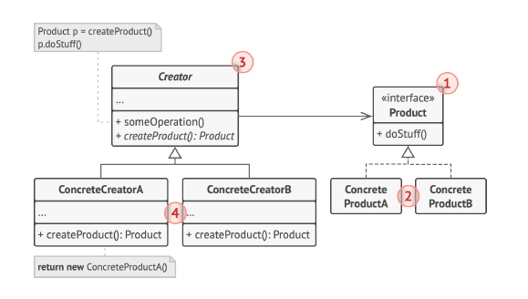

# Factory method (Фабричный метод) или виртуальный конструктор (Virtual Constructor) 
##### Type: Creational patten

##### Description:  
Фабричный метод - это порождающий шаблон проектирования, предоставляющий подклассам (дочерним классам) интерфейс для создания экземпляров некоторого класса. В момент создания наследники могут определить, какой класс создавать. Иными словами, данный шаблон делегирует создание объектов наследникам родительского класса. Это позволяет использовать в коде программы не специфические классы, а манипулировать абстрактными объектами на более высоком уровне.

##### Purpose:
Определяет интерфейс для создания объекта, но оставляет подклассам решение о том, какой класс инстанцировать. Фабричный метод позволяет классу делегировать создание подклассов. 
 
##### Structure
 - *Product* - определяет общий интерфейс объектов, которые может произвести *Creator*, и его подклассы.
 - *ConcreteProductA-B* — конкретные продукты, реализуют интерфейс *Product*, но различаются реализацией.  
 - *Creator* — объявляет фабричный метод, который возвращает объект интерфейса *Product*. Может также содержать реализацию этого метода «по умолчанию»;
может вызывать фабричный метод для создания объекта типа Product;   
**НО:** *Несмотря на название, важно понимать, что создание продуктов не является единственной функцией создателя. Обычно он содержит и другой полезный код работы с продуктом*
 - ConcreteCreator — по-своему реализуют фабричный метод, производя те или иные конкретные продукты.   
 Фабричный метод не обязан всё время создавать новые объекты. Его можно переписать так, чтобы возвращать существующие объекты из какого-то хранилища или кэша.
 
##### Used in the cases:  
 - Когда классу заранее неизвестно, объекты каких подклассов ему нужно создавать.  
   
       Фабричный метод отделяет код производства продуктов от
       остального кода, который эти продукты использует.
       
       Благодаря этому, код производства можно расширять, не
       трогая основной. Так, чтобы добавить поддержку нового
       продукта, вам нужно создать новый подкласс и определить
       в нём фабричный метод, возвращая оттуда экземпляр ново-
       го продукта.
   
- Когда вы хотите дать возможность пользователям расши-
  рять части вашего фреймворка или библиотеки.
  
  *Пользователи могут расширять классы вашего фреймворка
   через наследование*
 
 - Когда класс спроектирован так, чтобы объекты, которые он создаёт, специфицировались подклассами.
  
##### Implementation:  
 1. Нужно привести все создаваемые продукты к общему интерфейсу.
 2. В классе *Creator*, создайте пустой фабричный метод. В качестве возвращаемоего типа нужно указать общий интерфейс *Product*.
 3. Для каждого типа продуктов, создайте подкласс *ConcreteProductCreator* и переопределите в нем фабричный метод.
 4. Найти в коде все участки создающие *Product*. Замените участки вызовами фабричного метода *ConcreteProductCreator::createProduct()*, перенося инстанс *Product* в класс создания конкретного продукта *ConcreteProductCreator*
 5. Если создаваемых *продуктов* слишком много для существующих *подклассов создателя*, вы можете подумать о введении параметров в фабричный метод, которые позволят возвращать различные продукты в пределах одного подкласса.
 
         Например, у вас есть класс Почта с подклассами
         АвиаПочта и НаземнаяПочта , а также классы продуктов
         Самолёт , Грузовик и Поезд . Авиа соответствует
         Самолётам , но для НаземнойПочты есть сразу два продук-
         та. Вы могли бы создать новый подкласс почты для поездов,
         но проблему можно решить и по-другому. Клиентский код
         может передавать в фабричный метод НаземнойПочты аргу-
         мент, контролирующий тип создаваемого продукта.

##### Pros:  
 - позволяет сделать код создания объектов более универсальным, не привязываясь к конкретным классам (ConcreteProduct), а оперируя лишь общим интерфейсом (Product);
 - позволяет установить связь между параллельными иерархиями классов.
 - Упрощает добавление новых продуктов в программу.
 - Реализует принцип открытости/закрытости.

##### Minuses:
 - Даже для одного объекта необходимо создать соответствующую фабрику, что увеличивает код.
  (необходимость создавать наследника Creator для каждого нового типа продукта (ConcreteProduct).)
  - Может привести к созданию больших параллельных иерар-
    хий классов, так как для каждого класса продукта надо
    создать свой подкласс создателя.

##### Related templates:  
Многие архитектуры начинаются с применения **Фабричного
метода** (более простого и расширяемого через подклассы) и
эволюционируют в сторону **Абстрактной фабрики**, **Прототипа** или **Строителя** (более гибких, но и более сложных).

Фабричный метод можно рассматривать как частный случай
Шаблонного метода. Кроме того, Фабричный метод нередко
бывает частью большого класса с Шаблонными методами.

