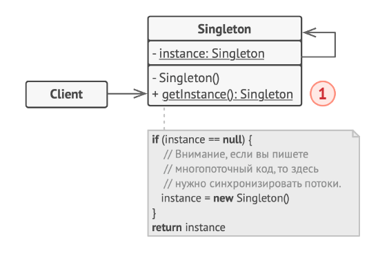

# Singleton (Одиночка)
##### Type: Creational patterns

##### Description:  
Порождающий шаблон проектирования, гарантирующий, что в однопоточном приложении будет единственный экземпляр некоторого класса, и предоставляющий глобальную точку доступа к этому экземпляру.
 
##### Used in the cases:  
 - если есть шансы, что один объект когда-нибудь превратится в несколько;
 - если интерфейс объекта (например, игрового мира) слишком сложен и не стоит засорять основное пространство имён большим количеством функций;
 - если, в зависимости от каких-нибудь условий и настроек, создаётся один из нескольких объектов. Например, в зависимости от того, ведётся лог или нет, создаётся настоящий объект, пишущий в файл, или «заглушка» - Null object
             
##### Pros:  
 - контролируемый доступ к единственному экземпляру (Если у нас есть имя класса, мы всегда можем вызвать статический метод getInstance())

##### Minuses:  
 - глобальные объекты могут быть вредны для объектного программирования, в некоторых случаях приводя к созданию немасштабируемого проекта;
 - усложняет написание модульных тестов и следование TDD.
 - усложняется контроль за межпоточными гонками и задержками. (в многопоточных системах)
 - нарушает принцип Single Responsibility (Singleton-класс отвечает сразу за две вещи: за то, что класс имеет лишь один объект, и за реализацию того, для чего этот класс вообще был создан).

##### Related templates:  
 - Фасад можно сделать Одиночкой, так как обычно нужен только один объект-фасад.
 - Абстрактная фабрика, Строитель и Прототип могут быть реа-
   лизованы при помощи Одиночки.
 - Паттерн Легковес может напоминать Одиночку:
      1. В отличие от Одиночки, вы можете иметь множество объ-
 ектов-легковесов.
      2. Объекты-легковесы должны быть неизменяемыми, тогда
 как объект-одиночка допускает изменение своего
 состояния.
